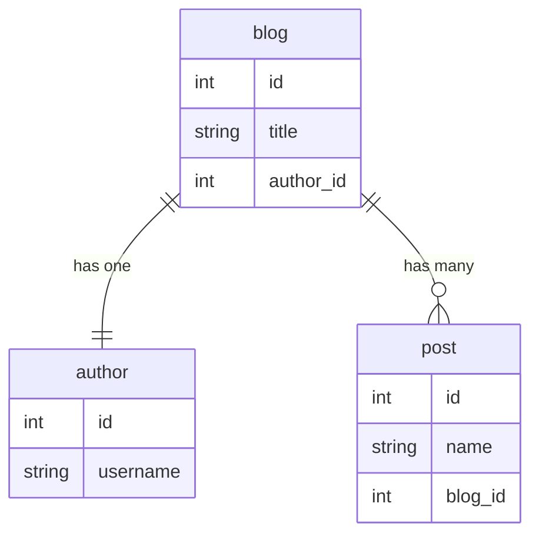

# Carta
[](https://coveralls.io/github/hackafterdark/carta?branch=main)

A simple SQL data mapper for complex Go structs. Load SQL data onto Go structs while keeping track of has-one and has-many relationships.

Carta is not an object-relational mapper (ORM). With large and complex datasets, using ORMs becomes restrictive and reduces performance when working with complex queries. [Read more about the design philosophy.](#design-philosophy)

## Examples 
Using carta is very simple. All you need to do is: 
```
// 1) Run your query
if rows, err = sqlDB.Query(blogQuery); err != nil {
	// error
}

// 2) Instantiate a slice(or struct) which you want to populate 
blogs := []Blog{}

// 3) Map the SQL rows to your slice
carta.Map(rows, &blogs)
```

Assume that in the above example, we are using a schema containing has-one and has-many relationships, as illustrated in the diagram below:



And here is our SQL query along with the corresponding Go struct:
```
select
       b.id,
       b.title,
       p.id        as  "posts->id",         
       p.name      as  "posts->name",
       a.id        as  "author->id",      
       a.username  as  "author->username"
from blog b
       left outer join author a    on  b.author_id = a.id
       left outer join post p      on  b.id = p.blog_id
```

```
type Blog struct {
        Id     int    `db:"id"`
        Title  string `db:"title"`
        Posts  []Post `carta:"posts"`
        Author Author `carta:"author"`
}
type Post struct {
        Id   int    `db:"id"`
        Name string `db:"name"`
}
type Author struct {
        Id       int    `db:"id"`
        Username string `db:"username"`
}
```
Carta will map the SQL rows while keeping track of those relationships. 

Results: 
```
rows:
id | title | posts->id | posts->name | author->id | author->username
1  | Foo   | 1         | Bar         | 1          | John
1  | Foo   | 2         | Baz         | 1          | John
2  | Egg   | 3         | Beacon      | 2          | Ed

blogs:
[{
	"id": 1,
	"title": "Foo",
	"author": {
		"id": 1,
		"username": "John"
	},
	"posts": [{
			"id": 1,
			"name": "Bar"
		}, {
			"id": 2,
			"name": "Baz"
		}]
}, {
	"id": 2,
	"title": "Egg",
	"author": {
		"id": 2,
		"username": "Ed"
	},
	"posts": [{
			"id": 3,
			"name": "Beacon"
		}]
}]
```

## Guide

### Column and Field Names

Carta matches your SQL columns with the corresponding struct fields.

#### Basic Fields
For basic types (int, string, etc.), use the `db` tag to specify the column name. If no tag is provided, Carta will use the snake_case version of the field name.

```go
type User struct {
	// Tag is specified, so "user_id" is the expected column name.
	Id int `db:"user_id"`

	// No tag, so "user_name" is the expected column name.
	UserName string
}
```

#### Associations (Nested Structs)
For nested structs (has-one or has-many relationships), use the `carta` tag to define a prefix for the nested struct's columns. The default delimiter is `->`, but `_` is also supported out-of-the-box for convenience. This dual support does not create conflicts with field names containing underscores (e.g., `first_name`) because mapping is based on the final, unambiguous column names returned by your `SELECT` query, which you control via SQL aliases.

**Example:**
```go
type Blog struct {
    Id     int    `db:"id"`
    Title  string `db:"title"`
    Author Author `carta:"author"` // "author" is the prefix
}

type Author struct {
    Id       int    `db:"id"`       // Maps to "author->id"
    Username string `db:"username"` // Maps to "author->username"
}
```

**Corresponding SQL Query:**
```sql
select
    b.id,
    b.title,
    a.id as "author->id",
    a.username as "author->username"
from blogs b
left join authors a on b.author_id = a.id
```
*(Note: Quoting the alias may be necessary depending on the SQL dialect)*

This design promotes struct reusability. The `Author` struct can be used on its own to map to a query like `select id, username from authors` or as a nested struct within `Blog` as shown above.

**Custom Delimiter:**
If you need to use a delimiter other than the default `->` or the supported `_`, you can override it by specifying it in the `carta` tag.
```go
type Blog struct {
    Author Author `carta:"author,delimiter=."` // Using a dot as a delimiter
}
```
**Corresponding SQL Query:**
```sql
select
    a.id as "author.id",
    a.username as "author.username"
...
```

### SQLX Support
Carta provides a convenience function, `Mapx`, for use with the `github.com/jmoiron/sqlx` package. Since `sqlx.Rows` is a wrapper around the standard `sql.Rows`, `Mapx` simply extracts the underlying `sql.Rows` and passes it to the standard `Map` function.

**Example:**
```go
import "github.com/jmoiron/sqlx"

// Assume db is an *sqlx.DB instance

rows, err := db.Queryx(query)
if err != nil {
    // handle error
}

var blogs []*Blog
err = carta.Mapx(rows, &blogs)
if err != nil {
    // handle error
}
```

### Data Types and Relationships

Any primative types, `time.Time`, `timestamppb.Timestamp` (from `google.golang.org/protobuf/types/known/timestamppb`), and `sql.NullX` can be loaded with Carta.
These types are one-to-one mapped with your SQL columns

To define more complex SQL relationships use slices and structs as in example below:

```
type Blog struct {
	BlogId int  // Will map directly with "blog_id" column 

	// If your SQL data can be "null", use pointers or sql.NullX
	AuthorId  *int
	CreatedOn *timestamppb.Timestamp // protobuf timestamp
	UpdatedOn *time.Time
	SonsorId  sql.NullInt64

	// To define has-one relationship, use nested structs 
	// or pointer to a struct
	Author *Author `carta:"author"`

	// To define has-many relationship, use slices
	// options include: *[]*Post, []*Post, *[]Post, []Post
	Posts []*Post `carta:"posts"`

	// If your has-many relationship corresponds to one column,
	// you can use a slice of a settable type
	TagIds     []int           `db:"tag_id"`
	CommentIds []sql.NullInt64 `db:"comment_id"`
}
```

### Database Driver Considerations

The behavior of `carta` can be influenced by the specific database driver you use, especially when handling date and time types.

`carta` expects the database driver to convert SQL date and time values into Go's `time.Time` type. While many drivers do this by default, some, like the popular `go-sql-driver/mysql`, require a specific connection string parameter to enable this behavior.

**MySQL Example:**
When using `go-sql-driver/mysql`, `DATE`, `DATETIME`, and `TIMESTAMP` columns are returned as raw bytes by default for performance reasons. To have them correctly scanned into `time.Time` fields, you **must** add `parseTime=true` to your DSN (Data Source Name).

Example Connection String:
`user:password@tcp(127.0.0.1:3306)/dbname?parseTime=true`

**A Note on the `TIME` Type:**
The SQL `TIME` type, which represents a time of day without a date, is not consistently handled by all drivers. Support for parsing the `TIME` type when it is returned as plain text will be added in a future version of Carta.

## Installation 
```
go get -u github.com/hackafterdark/carta
```

## Design Philosophy

The `carta` package follows a "fail-fast" philosophy to ensure that mapping operations are unambiguous and to protect users from silent bugs. For a detailed explanation of the error handling approach and the balance between user protection and graceful handling, please see the [Design Philosophies](./DESIGN_PHILOSOPHIES.md) document.

## Important Notes

When mapping to **slices of structs**, Carta removes duplicate entities. This is a side effect of the data mapping process, which merges rows that identify the same entity (e.g., a `Blog` with the same ID appearing in multiple rows due to a `JOIN`). To ensure correct mapping, you should always include uniquely identifiable columns (like a primary key) in your query for each struct entity.

When mapping to **slices of basic types** (e.g., `[]string`, `[]int`), every row from the query is treated as a unique element, and **no de-duplication occurs**.
 
To prevent relatively expensive reflect operations, carta caches the structure of your struct using the column names of your query response as well as the type of your struct.
